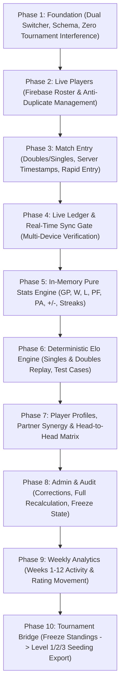

# 12-Week Badminton Season Tracker & Dynamic Elo League — Implementation Plan (v2.0)

> **Portal:** Sindhi Boys Badminton Cup & Season Portal  
> **Status:** Architecture Approved & Ready for Implementation  
> **Core Principle:** **Firebase match ledger is the single source of truth.** All statistics, standings, Elo ratings, partner synergies, and head-to-head records are 100% reproducible by deterministic chronological replay.

---

## 1. Architectural Principles & Security Design

1. **Source of Truth vs Disposable Cache**:
   * **Permanent**: `/seasons/{seasonId}/players/` and `/seasons/{seasonId}/matches/`
   * **Disposable Cache**: `/seasons/{seasonId}/computed/` (can be deleted at any time and rebuilt via 1-click **Recalculate Entire Season**).
2. **Deterministic Match Replay for Elo**:
   * Match order is strictly deterministic: ordered by `createdAt ASC` with `matchId ASC` as tie-breaker.
   * If any historical match is edited or deleted, the system replays all matches from $1 \dots N$ to recompute exact Elo progressions.
3. **Server Timestamps & Auth UIDs**:
   * Use `firebase.database.ServerValue.TIMESTAMP` (`createdAt`) to eliminate client clock skew.
   * Store `enteredByUid` (`auth.currentUser.uid`) and `enteredByName` for rock-solid Firebase Security Rule validation.
4. **Strict Separation of Singles & Doubles Elo**:
   * Every player maintains independent ratings: `doublesElo` (default 1500) and `singlesElo` (default 1500). No artificial mathematical averaging. Combined view displays both ratings side-by-side with overall GP/W/L.
5. **Database-Enforced Season Freeze State**:
   * `config/status`: `ACTIVE` | `FROZEN` | `ARCHIVED`.
   * Security rules disallow match writing/editing when `status !== 'ACTIVE'`, unlockable only by organizers.

---

## 2. High-Level Architecture & Dual-Mode Portal

```
                       COMMUNITY BADMINTON CUP PORTAL
                                      │
            ┌─────────────────────────┴─────────────────────────┐
            │                                                   │
    🏆 TOURNAMENT MODE                                  📅 SEASON MODE
   (48-Match Fixed Mixer                             (12-Week Open Match Ledger,
    & Dynamic Finals System)                           Doubles & Singles Elo + Stats)
                                                                │
                   ┌─────────────────┬──────────────────────────┼─────────────────────────┬──────────────────────┐
                   │                 │                          │                         │                      │
             🏠 Season Home    ➕ Record Match            🏆 Leaderboard             👤 Players & H2H      ⚙️ Season Admin
             (Podium & Recent  (Doubles 2v2 / Singles 1v1  (Doubles / Singles /       (Partner Synergy,     (Player Roster,
              Live Feed)        Rapid Same-Player Entry)   Combined Standings)        Form, Rivalries)      Audit & Seeding)
```

---

## 3. Simplified Firebase Database Schema

```text
seasons/
  fall2026/
    config/
      name: "Sindhi Boys Badminton Season — Fall 2026"
      startDate: "2026-09-27"
      endDate: "2026-12-20"
      status: "ACTIVE"           // ACTIVE | FROZEN | ARCHIVED
      minGamesQualified: 15
      startingElo: 1500
      kFactor: 32

    players/
      p_001/
        id: "p_001"
        name: "Pardeep"
        normalizedName: "pardeep"
        active: true
        joinedAt: { ".sv": "timestamp" }
        createdByUid: "dQeJFYL20gS06FJ0bekA0onPQL62"

    matches/
      match_1727184600000_a1b2/
        id: "match_1727184600000_a1b2"
        matchType: "DOUBLES"     // DOUBLES | SINGLES
        matchDate: "2026-09-27"
        createdAt: 1727184600000 // ServerValue.TIMESTAMP
        enteredByUid: "dQeJFYL20gS06FJ0bekA0onPQL62"
        enteredByName: "Pardeep"

        // Doubles Payload
        teamA: {
          player1: "p_001",
          player2: "p_002"
        }
        teamB: {
          player1: "p_003",
          player2: "p_004"
        }

        // Singles Payload (if matchType === "SINGLES")
        // playerA: "p_001",
        // playerB: "p_003",

        scoreA: 21
        scoreB: 17
        winner: "A"              // A | B

        court: "Court 1"
        session: "Sunday Afternoon"
        notes: ""

        revision: 1
        updatedAt: 1727184600000
        updatedByUid: "dQeJFYL20gS06FJ0bekA0onPQL62"

    audit/
      log_1727184600000_01/
        action: "MATCH_CREATED"
        targetId: "match_1727184600000_a1b2"
        timestamp: 1727184600000
        actorUid: "dQeJFYL20gS06FJ0bekA0onPQL62"

    computed/                    // Disposable cache (rebuilt on demand)
      playerStats/
      ratings/
      partnerships/
      headToHead/
      weekly/
```

---

## 4. Hall-Optimized Score Entry UX

Designed specifically for fast entry between court games:

```
┌──────────────────────────────────────────────────────────┐
│                   ➕ RECORD MATCH                        │
│            [ 👥 Doubles ]   [ 👤 Singles ]               │
├──────────────────────────────────────────────────────────┤
│  TEAM A                                                  │
│  [ Pardeep          ▼ ]                                  │
│  [ Ajeet            ▼ ]                                  │
│                                                          │
│                     ┌────┐                               │
│                     │ 21 │                               │
│                     └────┘                               │
│                       VS                                 │
│                     ┌────┐                               │
│                     │ 17 │                               │
│                     └────┘                               │
│  TEAM B                                                  │
│  [ Wijai            ▼ ]                                  │
│  [ Deepak           ▼ ]                                  │
│                                                          │
│  [ 🏸 SAVE GAME ]                                        │
└──────────────────────────────────────────────────────────┘
```

### Post-Save Fast Action Flow:
1. Instant toast notification: **`✓ Pardeep + Ajeet 21–17 Wijai + Deepak (Rankings Updated)`**
2. Clear score inputs to prevent accidental double-submits.
3. Keep player selections active and display quick-action buttons:
   * **`[ 🔄 Same Players ]`**: Ready for Game 2 of the same 4 players immediately.
   * **`[ ➕ New Match ]`**: Clears all dropdowns for a fresh group.

---

## 5. Elo Formulation & Analytics Engine

### A. Doubles Elo (2v2)
* $\bar{R}_A = \frac{R_{p1} + R_{p2}}{2}, \quad \bar{R}_B = \frac{R_{p3} + R_{p4}}{2}$
* $E_A = \frac{1}{1 + 10^{(\bar{R}_B - \bar{R}_A) / 400}}, \quad E_B = 1 - E_A$
* $\Delta R_A = K \times (S_A - E_A), \quad \Delta R_B = -\Delta R_A \quad (K = 32)$
* Applied equally to both players on Team A and Team B.

### B. Singles Elo (1v1)
* $E_A = \frac{1}{1 + 10^{(R_B - R_A) / 400}}, \quad E_B = 1 - E_A$
* $\Delta R_A = K \times (S_A - E_A), \quad \Delta R_B = -\Delta R_A \quad (K = 32)$

### C. In-Memory Calculation Engine
* **Leaderboards**: Dual rating views (Elo vs Win%/+/- Standings) for Doubles, Singles, and Combined.
* **Badges**: `PROVISIONAL` (< 15 games) vs `QUALIFIED` ($\ge$ 15 games).
* **Partner Synergy**: Matches, wins, losses, win% with every doubles partner.
* **Head-to-Head**: Record and scoring margin against every opponent.

---

## 6. End-to-End 10-Phase Implementation Roadmap



| Phase | Core Objective | Key Deliverables & Validation Gate |
| :--- | :--- | :--- |
| **Phase 1: Foundation** | Dual Mode Navigation & State Isolation | • Header mode switcher `[🏆 Tournament]` vs `[📅 Season]`<br>• Isolated Season CSS & JS namespace<br>• **Gate**: Verify Tournament Mode is 100% unaffected. |
| **Phase 2: Players** | Live Firebase Roster | • Add player modal, active/deactivate toggle<br>• Duplicate name validation (`normalizedName`)<br>• Real-time player dropdown synchronization across clients. |
| **Phase 3: Match Entry** | Fast Hall Scoring (Doubles & Singles) | • Doubles (4 players) & Singles (2 players) modes<br>• Anti-duplicate dropdown reactive filtering<br>• Open score entry with unlimited deuce support<br>• Server timestamps (`.sv: "timestamp"`) & Auth UID tagging<br>• `[Same Players]` vs `[New Match]` instant workflow. |
| **Phase 4: Live Ledger & Sync Gate** | Real-Time Match History | • Real-time chronological match feed with search & filters<br>• **Gate**: Multi-Device Test (Phone A records match $\rightarrow$ Phone B sees it instantly). |
| **Phase 5: Stats Engine** | Pure In-Memory Statistical Aggregations | • Computes GP, W, L, Win %, PF, PA, +/-, Avg +/-, streaks, and last 5 form from raw match ledger. |
| **Phase 6: Elo Engine** | Deterministic Chronological Elo Replay | • Independent Singles Elo & Doubles Elo ($K=32$, Base 1500)<br>• Deterministic sorting (`createdAt ASC, matchId ASC`)<br>• Verified against automated hand-calculated test cases. |
| **Phase 7: Profiles & Analytics** | Profiles, Partner Synergy & H2H Matrix | • Player profile cards with Doubles/Singles breakdown<br>• Partner Synergy matrix (best doubles combinations)<br>• Head-to-Head rivalry records against every opponent<br>• Elo progression rating history. |
| **Phase 8: Administration & Audit** | Safeguards & Security Freeze | • Edit match modal triggering full $1\dots N$ deterministic replay<br>• 1-Click **`♻ Recalculate Entire Season`** button<br>• Season Freeze state (`ACTIVE` vs `FROZEN`) enforced by Firebase Rules. |
| **Phase 9: Weekly Analytics** | 12-Week Progress Tracking | • Weekly milestone breakdown (Weeks 1–12)<br>• Most active player, top win streak, biggest rating climber. |
| **Phase 10: Tournament Bridge** | Evidence-Based Tournament Seeding | • Standings snapshot export<br>• Auto-categorize qualified players into **Level 1 / Level 2 / Level 3** tiers based on final season Elo for seeding future tournament mixers. |

---

## 7. Immediate Next Step

We are ready to start **Phase 1: Foundation (Mode Switcher & UI Scaffold)**.
